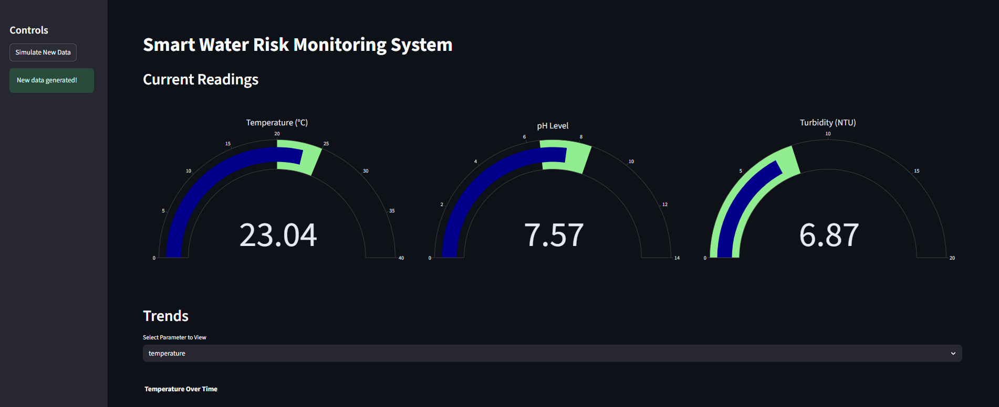

# 🚰 Smart Water Risk Monitoring & AI Reporting System

> **An end-to-end IoT platform for real-time water quality monitoring, AI-powered risk assessment, and automated reporting to prevent Legionella outbreaks.**

[](LICENSE)


---

## 🧠 Overview

This system simulates IoT sensors to collect water quality data, assesses risk using machine learning, and provides real-time visualization and AI-generated reports.
Perfect for **buildings, healthcare facilities, and public utilities** aiming to maintain water safety standards.

---

## 🔍 Key Features

### 🌡️ Water Quality Monitoring

* Simulates sensors for temperature, pH, turbidity, dissolved oxygen, and conductivity
* Stores real-time data in an SQLite database

### 🧠 AI Risk Detection

* Predicts Legionella risk using a trained ML model
* Analyzes historical patterns & detects anomalies

### 📊 Interactive Dashboard

* Built with **Streamlit**
* Live charts and health indicators
* Exportable reports and historical analysis

### 📝 RAG-Powered Reporting

* Uses **OpenAI + LangChain** for automated summaries
* Generates risk-level reports with safety recommendations (PDF support)

---

## 📁 Folder Structure

```
smart-water-risk-monitoring/
├── src/
│   ├── api/               # FastAPI endpoints
│   ├── models/            # ML models & DB models
│   ├── services/          # Business logic
│   ├── middleware/        # Request/response middleware
│   ├── utils/             # Helper functions
│   ├── dashboard.py       # Streamlit dashboard
│   ├── report_generator.py # RAG report generation
│   └── risk_prediction.py # ML pipeline
│
├── data/
│   ├── db/                # SQLite files
│   └── logs/              # Application logs
│
├── notebooks/             # Jupyter analysis & experiments
├── docs/                  # API and usage docs
├── .github/               # GitHub workflows
├── .env.example           # Environment variable template
├── requirements.txt       # Dependencies
├── Dockerfile             # Docker image setup
├── docker-compose.yml     # Docker orchestration
└── README.md              # You're here!
```

---

## ⚙️ Getting Started

### 🔧 Setup

```bash
git clone https://github.com/yourusername/smart-water-risk-monitoring.git
cd smart-water-risk-monitoring
```

### 🐍 Create Virtual Environment

```bash
python -m venv .venv
source .venv/bin/activate      # Windows: .venv\Scripts\activate
pip install -r requirements.txt
```

### 🔐 Configure Environment

```bash
cp .env.example .env
# Add your OpenAI API key & configs to .env
```

---

## 🚀 Running the App

### 1. Simulate Sensor Data

```bash
python src/sensor_simulation.py
```

### 2. Train & Run Risk Prediction Model

```bash
python src/risk_prediction.py
```

### 3. Launch Streamlit Dashboard

```bash
streamlit run src/dashboard.py
```

### 4. Launch FastAPI Backend

```bash
uvicorn main:app --reload
```

---

## 🧪 Testing & Linting

```bash
pytest                   # Run tests
flake8 src tests         # Lint code
mypy src                 # Type checking
```

---

## 🔐 Security Highlights

* Environment-based secret management
* SQL injection and XSS-safe inputs
* Prepped for OAuth2 / JWT Auth
* Scalable and containerized with Docker

---

## 📈 Future Improvements

* ✅ Redis-based caching for faster model inference
* ✅ Real sensor integration (ESP32, Arduino, etc.)
* ⏳ Multi-user role-based authentication
* ⏳ Integration with cloud dashboards (e.g., Grafana)

---

## 📚 Acknowledgments

* [FastAPI](https://fastapi.tiangolo.com)
* [Streamlit](https://streamlit.io/)
* [LangChain](https://www.langchain.com/)
* [OpenAI API](https://platform.openai.com/)

---

## 📄 License

This project is licensed under the **MIT License** — see the [LICENSE](LICENSE) file for details.

---

## 🤝 Contributing

Pull requests are welcome! For major changes, please open an issue first to discuss what you’d like to change.

> ⭐ Star this repo to support the project!

---

## 🎥 Screenshots / Demo 



---